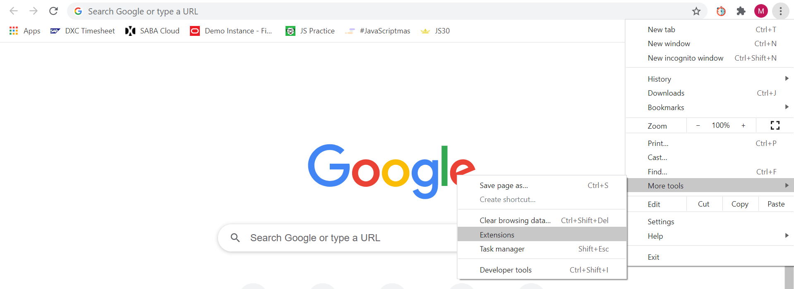
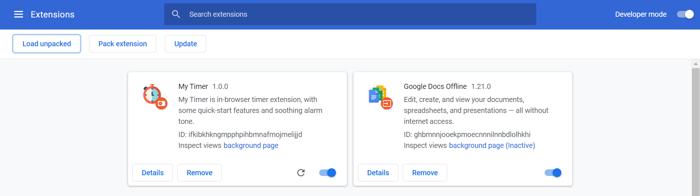
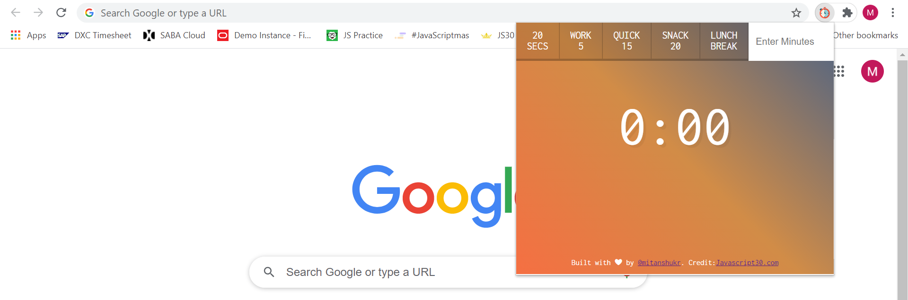
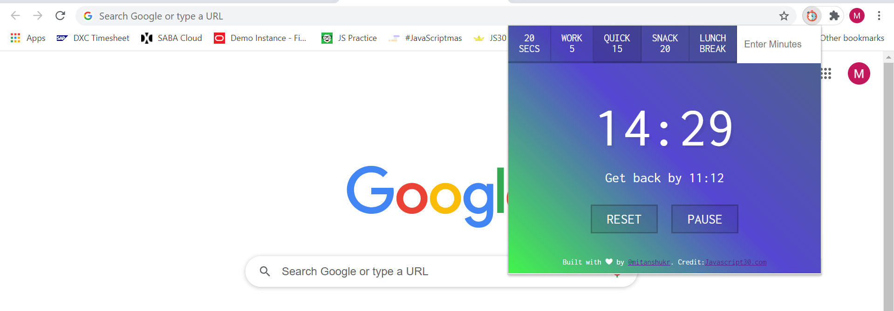

# MyTimer Chrome Extension
**_A chrome extension for in-browser timer alarm with soothing alarm tone and vibrant colors._**


This is a Timer Extension app to get an in-browser timer facility. The added _Quick-start buttons_ and dynamic _vibrant background colors_ make the application exceptional and attractive.
The alarm tone has also been chosen with great care to provide a **refreshing and energetic experience** to the users.

#### Used Stacks:
1. HTML and CSS
2. Vanilla JS

## User Guide:
**Download and Install the extension in your browser.**

#### Step 1:
For Git users, copy-paste the following line in your **command prompt**.
```
git clone https://github.com/mitanshukr/MyTimer-Chrome-Extension.git
```
or, click on **Code** button and choose **Download ZIP** at top of this page.

#### Step 2:
+ Next, Unzip/Unpack the downloded file.
+ Go the your Chrome browser.
+ Click on the three dots at top right corner.
+ Go to the **More Tools** and then click on **Extensions**.



#### Step 3:
+ You will find all your downloded extenions there. Make sure the **Developer Option** is ON. If not, **toggle it to ON**.
+ You will see a **Load unpacked** button on left upper corner. Click on that and upload the downloaded unziped file.



**You are all set to use the attractive My Timer Extension.**

## Demo Screenshots:
**Here is the few demo screenshots of the application:**





## Feedback:
**Thank you so much for staying with me till this point. I'm sure, you gonna love this extension.**

Please let me know your reviews and feedbacks on this app/extension. 

_Feel free to Fork and pull-request for any improvement or fixes._

Thank you once again. :smiley:


